# OIDC

In the examples below, we'll have the following naming:

- realm `monitoring`;
- URLs:
  - [http://keycloak.localhost](http://keycloak.localhost);
  - [http://grafana.localhost](http://grafana.localhost);
  - [http://prometheus.localhost](http://prometheus.localhost);
  - [http://lfgw](http://lfgw);
- client ID: `grafana`.

## keycloak

### Realm

First, we need to create a Realm for our users:

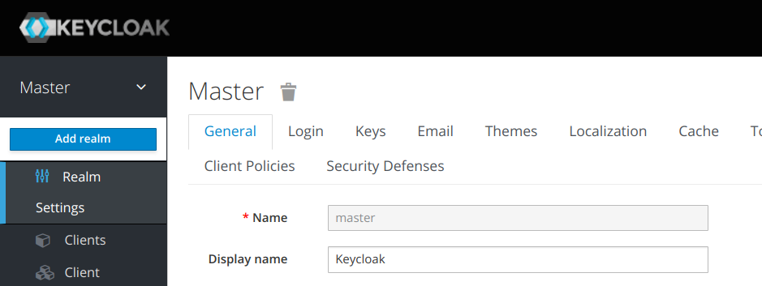

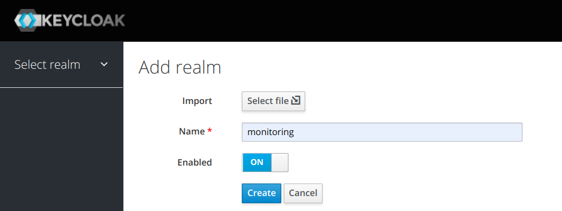

### Tokens

By default, grafana and keycloak have different values for session duration. If a session in keycloak expires earlier than in grafana, a refresh token will be revoked, and grafana will fail to obtain a new access token. In this case, grafana will silently stop adding `Authorization` header to its requests, thus making data source authentication fail until the user logs out and logs in again.

That's why it's important to tune `SSO Session Idle` and `SSO Session Max` (`Realm Settings` -> `Tokens`):

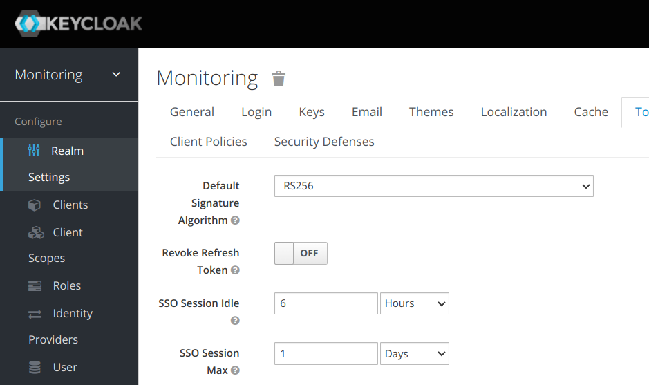

NOTE: the particular durations are not set in stone.

### Client

#### Client creation

Next, we need to create a client (`Clients` -> `Add Client`):

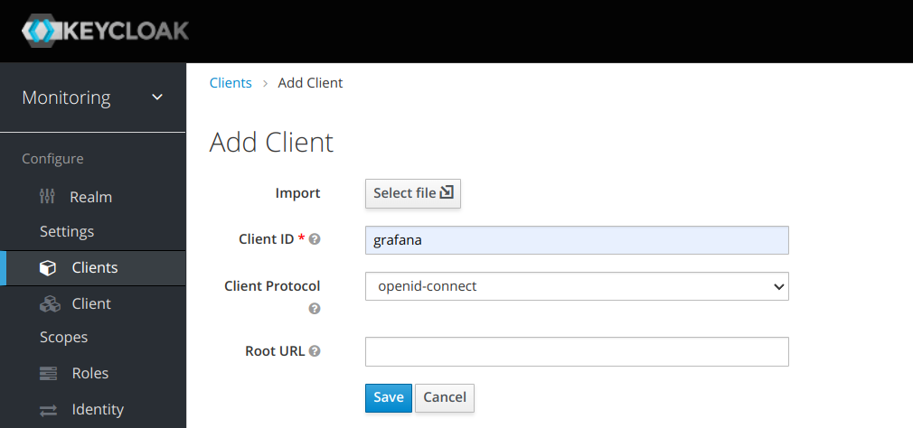

NOTE: It's better not to specify `Root URL` if the same realm is reused across different grafana instances.

In the client's settings (`Clients` -> `grafana`), `Access Type` should be changed to `confidential`:

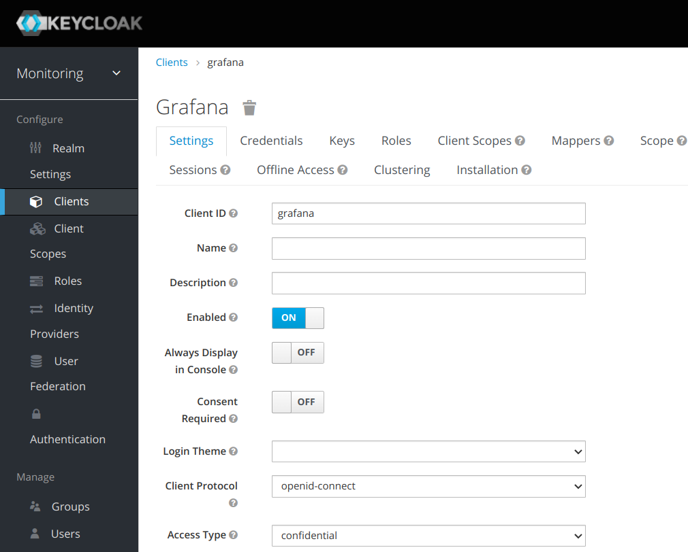

and `Valid Redirect URIs` to `http://grafana.localhost/*`:

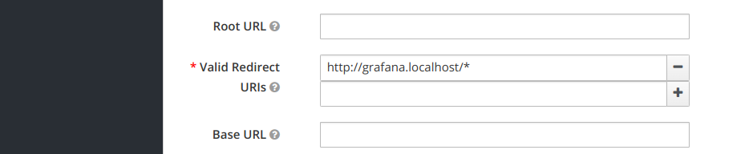

Then press `Save`.

#### Credentials

Copy `secret` (`Clients` -> `Credentials`), it will be needed for `client_secret` in grafana configuration:

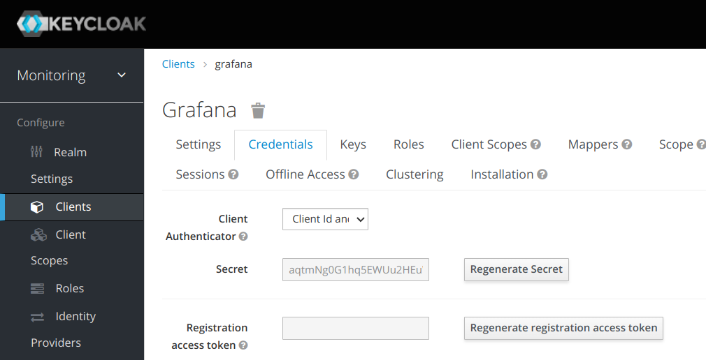

#### Mappers

To expose client roles (used by both grafana and lfgw to limit user access) and token audience (used for token validation), we need to create two mappers (`Clients` -> `grafana` -> `Mappers`):

-> Click `Create` and configure the mapper like on the screenshot below:

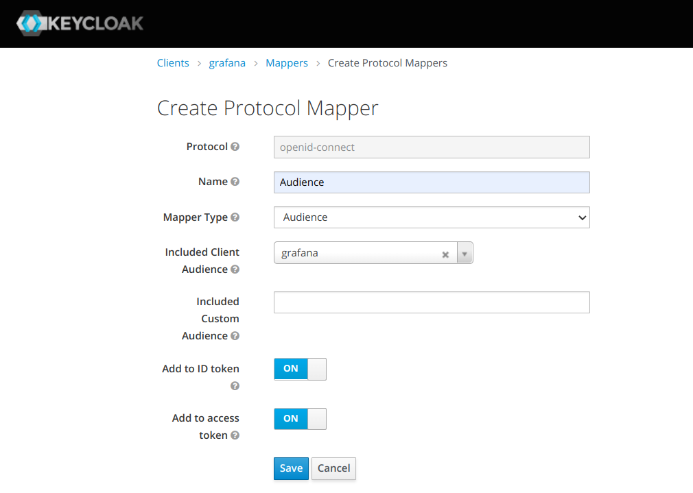

Get back to Mappers and click `Add Builtin` and pick `client roles`:

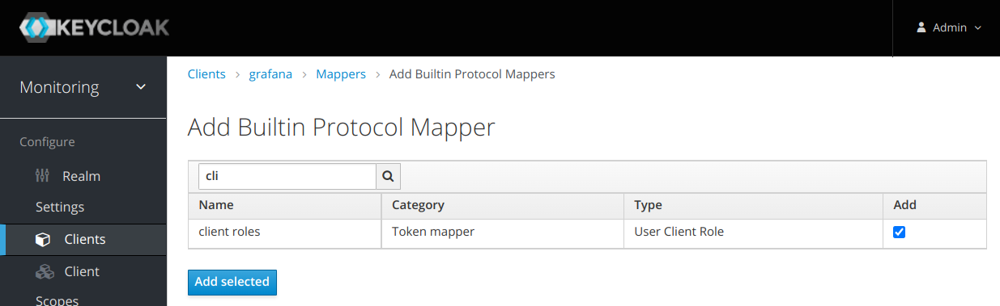

Click `Edit` next to `client roles`:

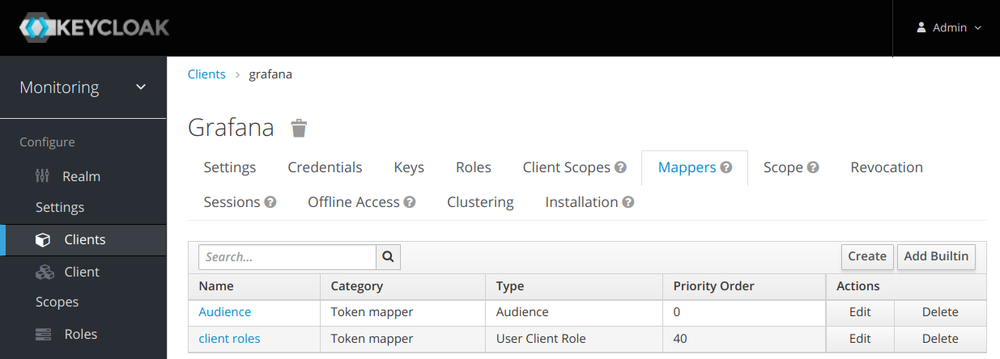

Configure the mapper like on the screenshot below:

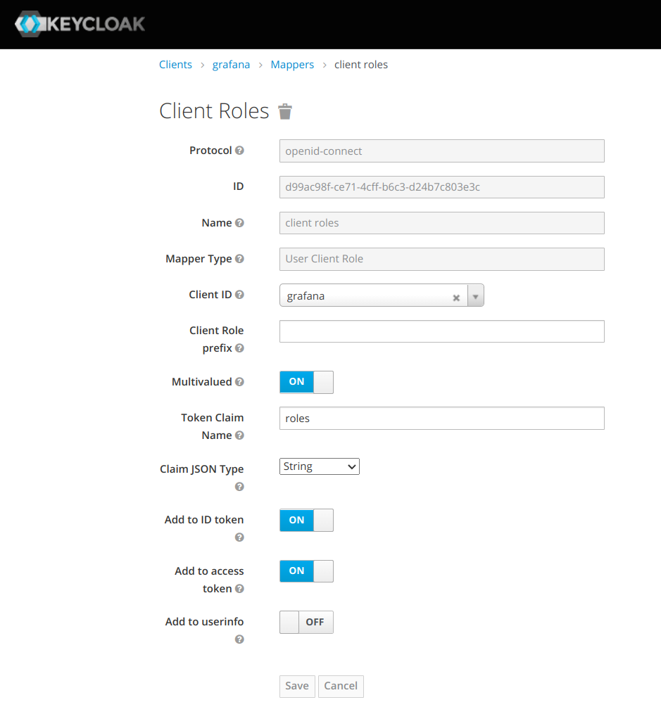

#### Roles

Now, we need to add some client roles (`Clients` -> `grafana` -> `Roles` -> `Add role`):

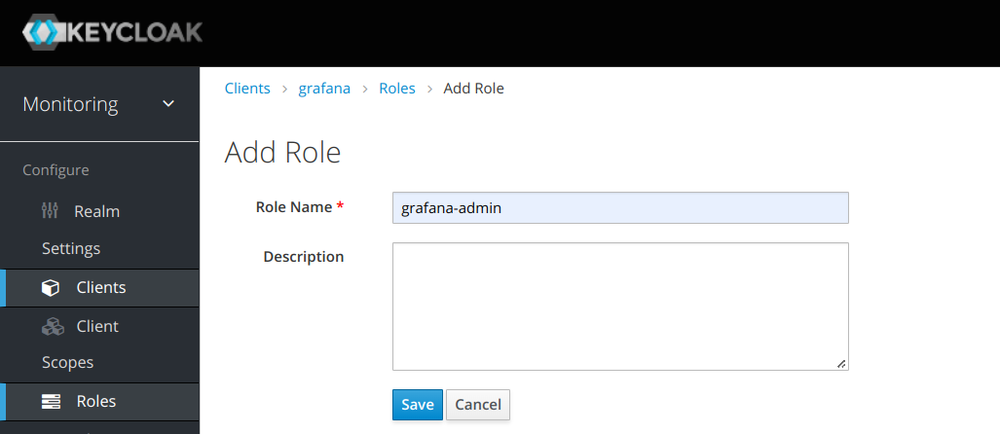


#### Users and role assignments

The last step would be to create a user and assign a role to him (`Users` -> `Add user`):

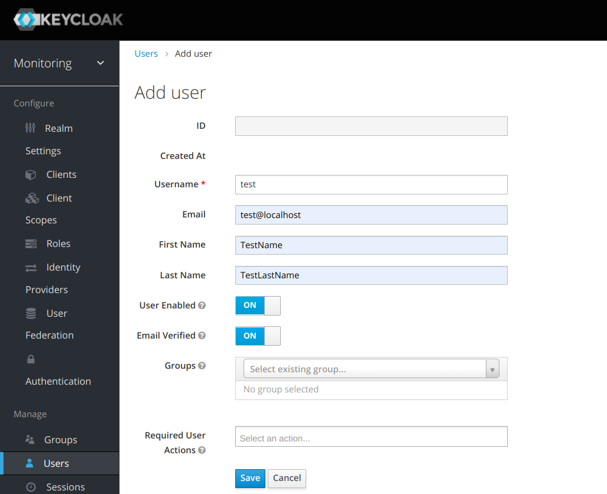

NOTE: `Email` must always be defined.

Set password (`Users` -> `test` -> `Credentials`):

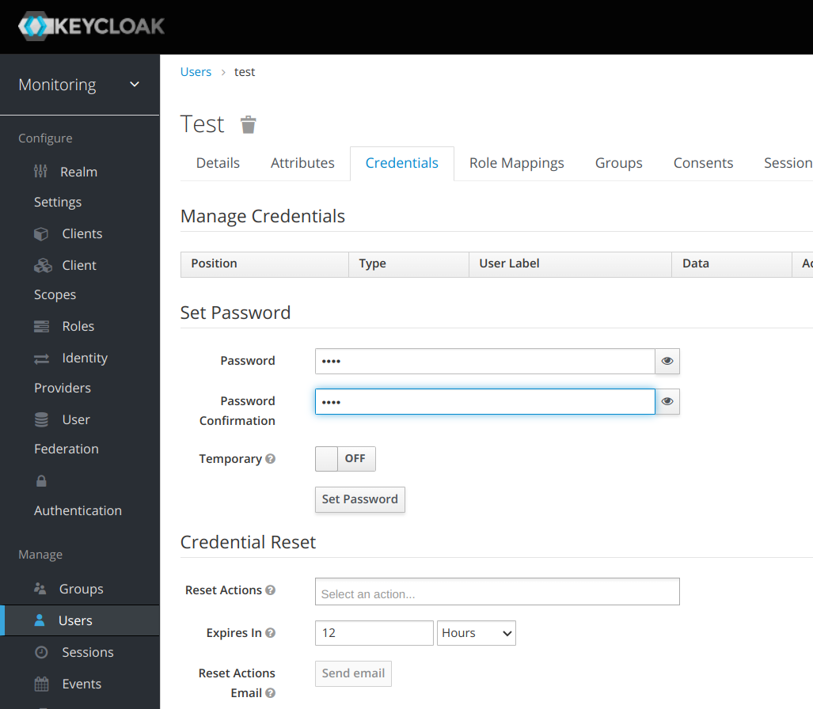

Pick a role and assign it (`Users` -> `test` -> `Role Mappings` -> `Client Roles` -> `grafana`):

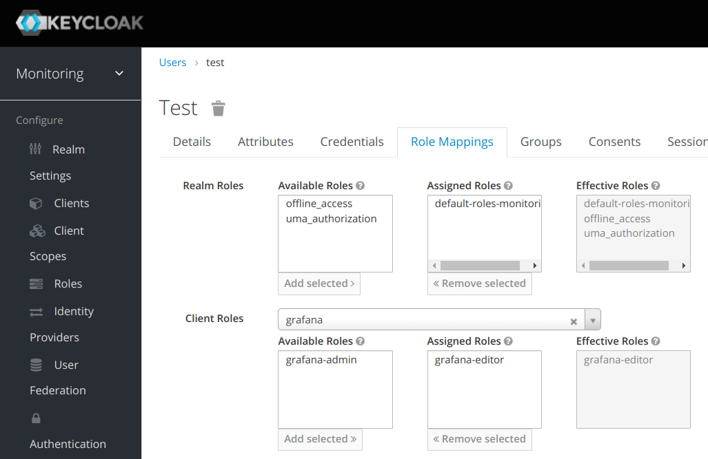

NOTE: A user may have many roles.

There are two sets of roles that you need to have:

- roles used by grafana itself (`grafana-admin` and `grafana-editor` in this case);
- roles used by lfgw.

Those roles' names can either be the same or different, depending on what you want to achieve. For simplicity of the example, here they have the same names.

## grafana

### Config

Below, you could find an example of how to configure OIDC integration between keycloak and grafana.

```ini
[ auth ]
# Disable the default loging form (only OIDC users are allowed to login)
disable_login_form = true
# Automatically redirect to Keycloak
oauth_auto_login = true
# Redirect users to Keycloak logout page and then back to grafana (if not configured, keycloak session will not end upon logout from grafana)
signout_redirect_url = http://keycloak.localhost/auth/realms/monitoring/protocol/openid-connect/logout?redirect_uri=http://grafana.localhost
# The maximum lifetime (duration) an authenticated user can be inactive before being required to login at next visit. Default is 7 days (7d). This setting should be expressed as a duration, e.g. 5m (minutes), 6h (hours), 10d (days), 2w (weeks), 1M (month). The lifetime resets at each successful token rotation (token_rotation_interval_minutes).
# NOTE: Should be lower than "SSO Session Idle" in Keycloak.
login_maximum_inactive_lifetime_duration = 4h
# The maximum lifetime (duration) an authenticated user can be logged in since login time before being required to login. Default is 30 days (30d). This setting should be expressed as a duration, e.g. 5m (minutes), 6h (hours), 10d (days), 2w (weeks), 1M (month).
# NOTE: Should be lower than "SSO Session Max" in Keycloak.
login_maximum_lifetime_duration = 8h

[ auth.generic_oauth ]
enabled = true
allow_sign_up = true
# The same client ID as added in Keycloak
client_id = grafana
# Client secret copied from Keycloak
client_secret = aqtmNg0G1hq5EWUu2HEuWJK93leVkBn2
# Those links point to keycloak URLs tied to our realm (monitoring)
auth_url = http://keycloak.localhost/auth/realms/monitoring/protocol/openid-connect/auth
token_url = http://keycloak.localhost/auth/realms/monitoring/protocol/openid-connect/token
api_url = http://keycloak.localhost/auth/realms/monitoring/protocol/openid-connect/userinfo
scopes = email profile
# grafana-admin will give "Admin" role, grafana-editor - "Editor", in all other cases a user will become "Viewer"
role_attribute_path = "contains(roles[*], 'grafana-admin') && 'Admin' || contains(roles[*], 'grafana-editor') && 'Editor' || 'Viewer'"
```

NOTE: If `login_maximum_inactive_lifetime_duration` and `login_maximum_lifetime_duration` are not properly set, then authentication to a data source will eventually fail, and a user will be required to logout-login as a workaround.

### Data source

Point grafana at a lfgw instance and make sure access token is forwarded (`Forward Oauth Identity`, available only in `Server` mode) (`Configuration` -> `Data sources` -> `<name>`):

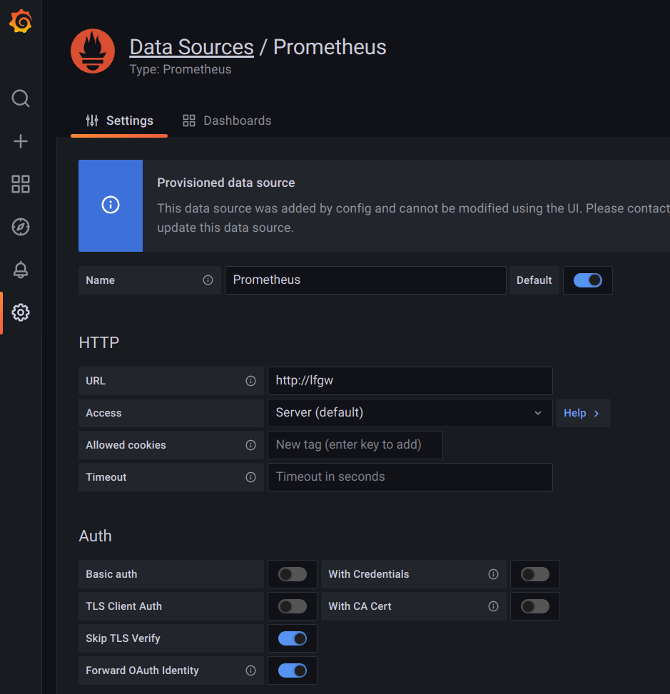

## lfgw

### Environment variables

```shell
# Prometheus / VictoriaMetrics base URL
export UPSTREAM_URL=http://prometheus.localhost
# Realm URL, lfgw uses the data exposed there to validate access tokens forwarded by grafana
export OIDC_REALM_URL=http://keycloak.localhost/auth/realms/monitoring
# Used to validate the Audience (aud) field in the tokens
export OIDC_CLIENT_ID=grafana
```

### ACL (acl.yaml)

```yaml
# Gives full access to metrics
grafana-admin: .*
# Gives access only for metrics from these namespaces
grafana-editor: ku.*, min.*, monitoring
```

The ACL definitions are, essentially, role to namespace bindings.

If "assumed roles" (autoconfiguration) functionality is enabled (`export ASSUMED_ROLES=true`), then unknown roles will be treated as ACL definitions. E.g. a role `.*` will give access to all metrics, `monitoring` - to those collected in the `monitoring` namespace.

You can have a mix of pre-defined roles and assumed roles if needed.

## Final notes

Once all of that is configured, a user can login to the grafana instance and have:

- a grafana role assigned depending on `role_attribute_path` in grafana settings (if there's no match, it'll be `Viewer`);
- metrics filtered based on lfgw ACL.
